Numerical solution of inhomogeneous fractional Cauchy problem 
==========================================


## About
This code demonstrates the numerical solution of the linear inhomogeneous Cauchy problem with [Caputo fractional derivative](https://en.wikipedia.org/wiki/Fractional_calculus#Caputo_fractional_derivative) in-time and second order elliptic partial differential operator coefficient in-space, defined on the finite 1D interval and accompanied by the zero Dirichlet boundary conditions. 
It uses an implementation of the method developed in the paper  

[1] **D. Sytnyk, B. Wohlmuth** *Exponentially convergent numerical method for abstract Cauchy problem with fractional derivative of Caputo type.* Mathematics 2023, 11(10), 2312; https://doi.org/10.3390/math11102312 [Up-to-date version on Arxiv: https://arxiv.org/abs/2304.13099]. 

Unlike classical finite-difference approximation schemes, this method does not require time-stepping and can be used to reliably approximate the solution for arbitrary small times (method's error estimates are uniform in time for $`t \in [0, T]`$ ). 
This is a unique feature among the class of methods for fractional Cauchy problems.  
In addition to that, the current implementation of the method can handle general nonzero initial conditions as well as arbitrary values of fractional order parameter $`\alpha \in [0.1, 1.9]`$. 
The range for $`\alpha`$ can be further extended with some problem-dependent tuning.

## Usage instructions
To recreate the result from Fig. 3, 4 of the paper the user needs to run the commands
```
run_gen_plot_sol_and_err_vs_t_fcp_hom;  
run_gen_plot_err_vs_N_fcp_hom_exact_R_exact_eigenfunc;
```
accordingly.

The results for the Example 2 corresponding to the inhomogeneous part of the solution can be generated using the commands
```
run_gen_plot_sol_and_err_vs_t_fcp_inhom;  
run_gen_plot_err_vs_N_fcp_inhom_exact_R_exact_eigenfunc;
```

The fully discretized version of the fractional Cauchy problem from Example 3 can be numerically solved with help of the code
```
run_gen_plot_sol_and_err_vs_t_fcp_cauchy__R_FD_Dirichlet;   
run_gen_plot_err_vs_N_fcp_cauchy_R_FD_Dirichlet;
```

Values of the fractional order parameter **alpha**, the propagator discretization parameter **N**, that controls approximation accuracy, as well as other problem dependent quantities are defined at the beginning of the corresponding script. 
The names of the most quantities in the scripts coincide with the notation from the paper. 
Some additional comments are provided throughout the code, where necessary.

Several of provided scripts have the ability to cache the results of the calculations into datastore (file with the script- and problem- dependent name and extension .mat) and then reuse them if called with the same set of parameters. 
This is especially useful for the generation of time-consuming "Error vs N" plots (see [1, Fig. 4,7,10]) .
The user must be careful with such functionality since the problem dependent datastore is not designed to guaranty the unique correspondence between the set of all specified problem parameters and the datastore filename. 
In addition to the code, we provide such cached calculation results that cover all the cases considered in the paper. 
To utilize the provided cache, the user needs to copy the content of subfolder `precalculated_results` into the folder with the code.

The current version of the code supports parallelization at the level of different resolvent evaluations (See Algorithms 1,2 from [1]) using the capabilities of MATLAB’s parallel computing toolbox. 
To turn it on the user needs to create a parallel pool via `parpool()` command, prior to running the mentioned above scrips.
Recent versions of Matlab performs some code vectorization by default, hence in the case of Example 1, 2 the additional parallelization might actually be detrimental to the overall performance because the single resolvent evaluation time is small. 
We advice to invoke the parallel mode only with Example 3, when the space-grid size is sufficiently large.  

## Code structure
All user-facing functionality is provided by the 6 top-level run scripts mentioned above.
These are self sufficient. 
The routines from `fcp_cauchy_hom_ex_sol_eigenfunction.m` and `fcp_cauchy_inhom_ex_sol_eigenfunction.m` are dependent on the function `ml` from the `contrib` folder. 
This function is develeoped and maintained by [Roberto Garrappa](https://www.mathworks.com/matlabcentral/fileexchange/48154-the-mittag-leffler-function?tab=reviews%2F1965593). 
To setup the path to `ml` for the use with the mentioned (or dependent) routines please run the `environment` script first.

Other routines in the code are as follows:

  - functions that start with `fcp_` are related to the top-level fractional Cauchy problem evaluation routines.
  - function `cauchy_int_matr_func` performs the Cauchy integral approximation. Most of the computations needed to numerically evaluate the values of the propagator function is done here. 
  - functions with `map_` and `quad_` prefixes are related to the quadrature evaluation routines.
  - the file `RLI_approx.m` contains the routines for the approximate evaluation of Rieman-Liouville integral.
  - the routines from files with `resolvent_` prefix are responsible for problem-dependent evaluation of the stationary operator's resolvent. 
  - files `helper_*.m` and `plot_*.m` contain auxiliary routines for plotting and postprocessing  

The provided code has a modular structure. 
The implementation of propagator approximation is separated from the routines responsible for a specific stationary operator/solver combination. 
As such, the current codebase can be easily extended to handle fractional Cauchy problem with different stationary operators.
This can be achieved by providing new `resolvent_` m-files.

## Documentations
All non-trivial functions have the documentation included in the comments at the beginning of the file.
In some cases, examples (might be outdated) and citations are also provided.

## Example results
### Semi-discretized linear homogeneous problem from Example 1
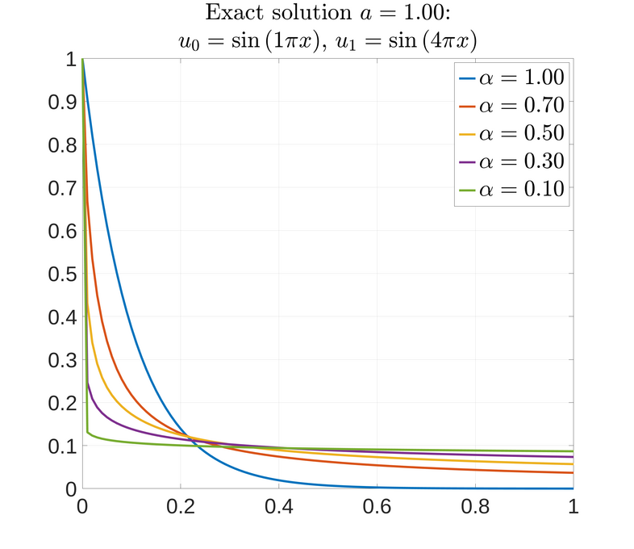 
<!--

 
<div align="center">
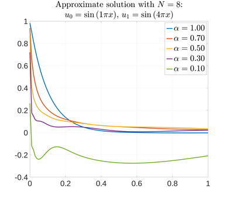 
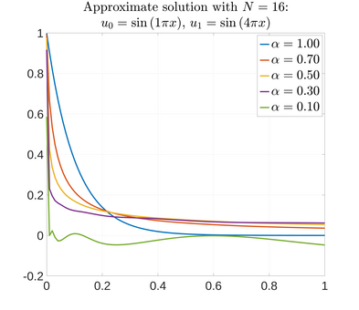 
</div>
<div align="center">
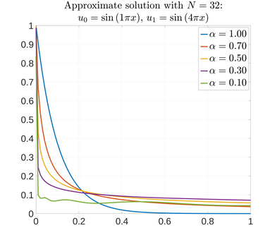 
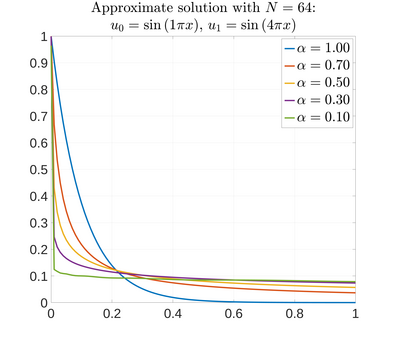 
</div>
<div align="center">
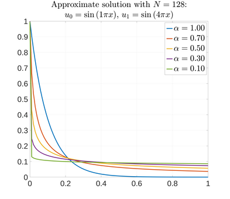 
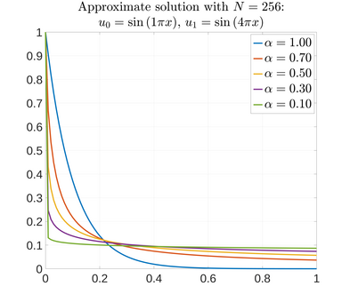 
</div>  -->
 


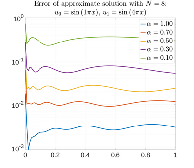
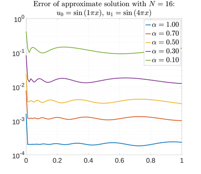
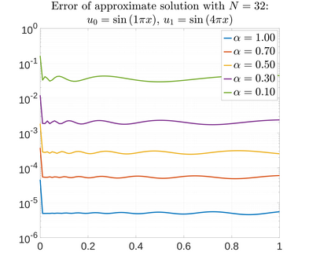
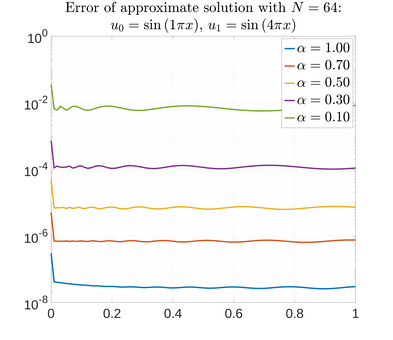
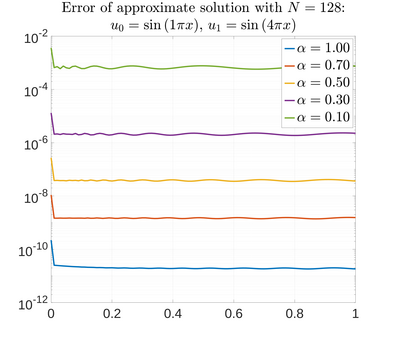
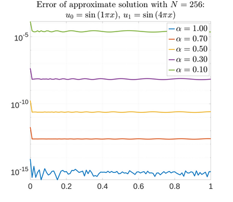
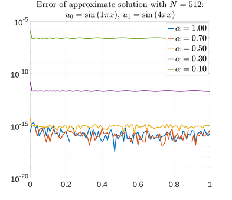
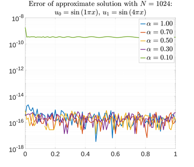

### Semi-discretized linear inhomogeneous problem with zero homogeneous part (Example 2)
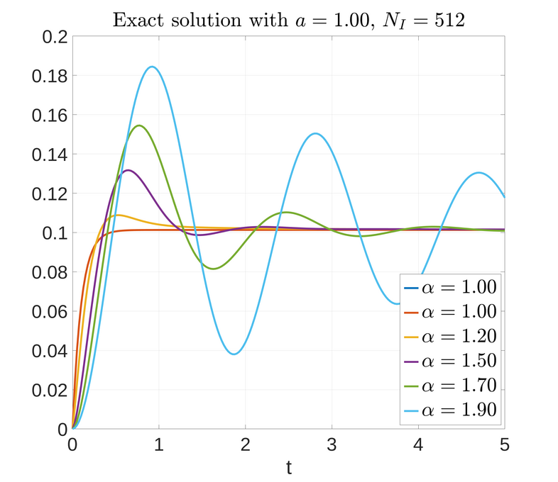

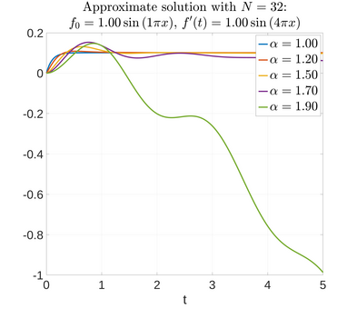
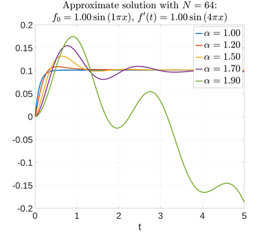
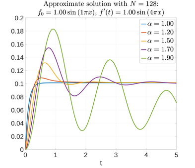

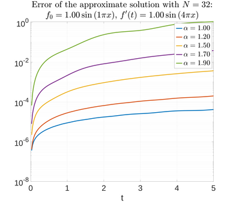
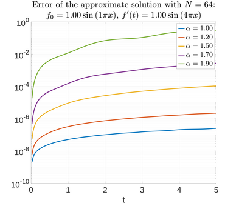
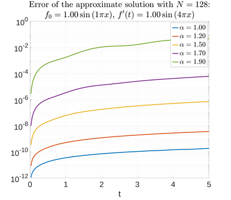

### Fully-discretized linear inhomogeneous problem with non-stationary right-hand side from Example 3
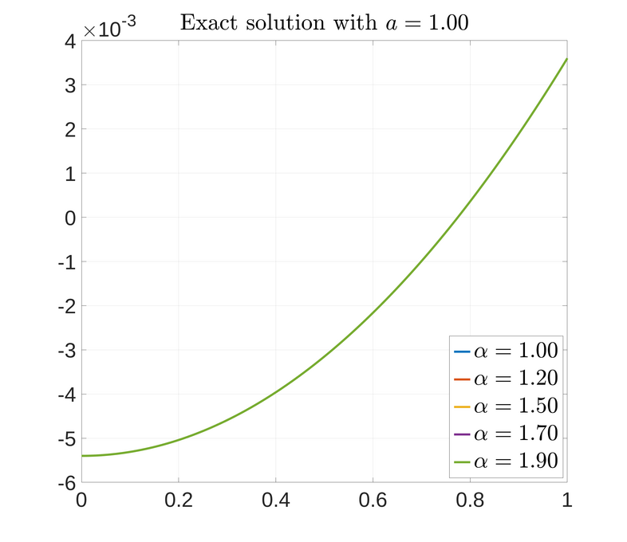
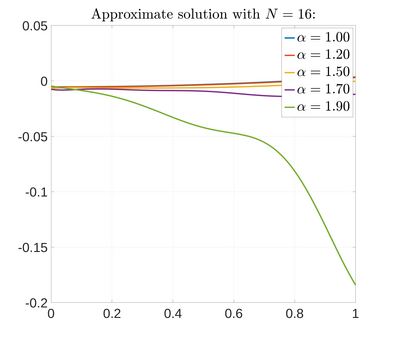
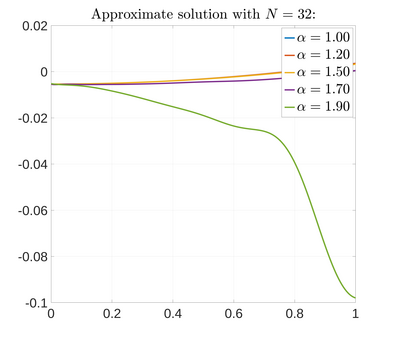
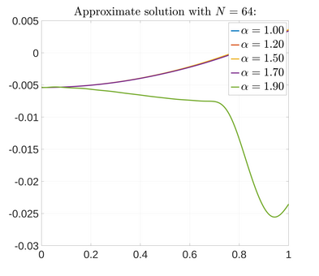
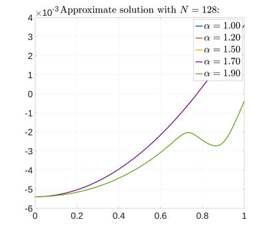
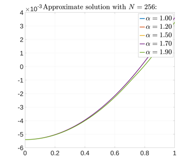

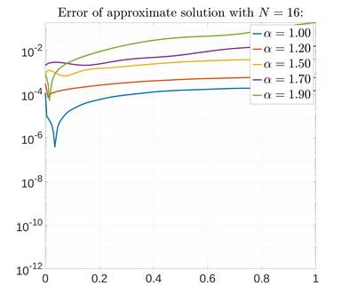
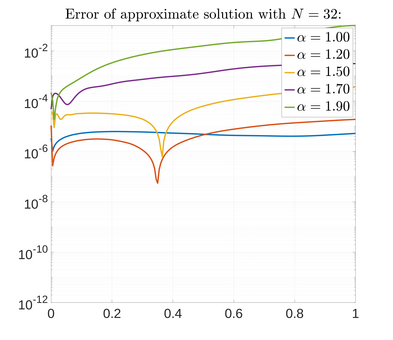
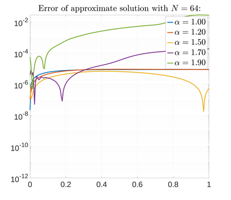
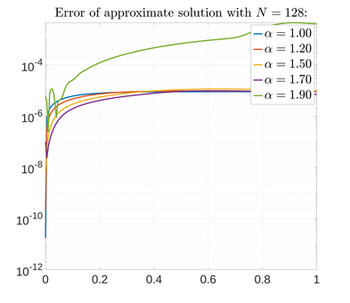
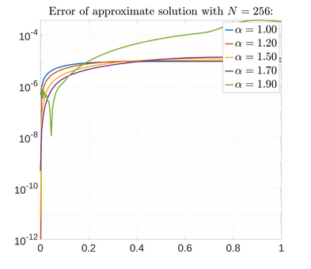

