## Selected results
### Semi-discretized linear homogeneous problem from Example 1
 
 
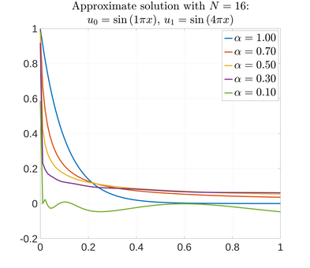

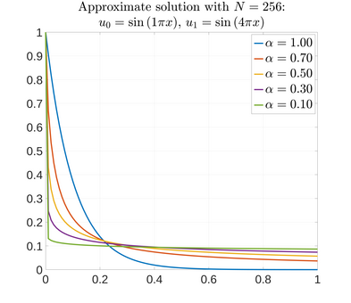

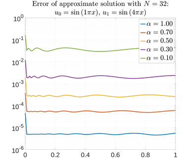

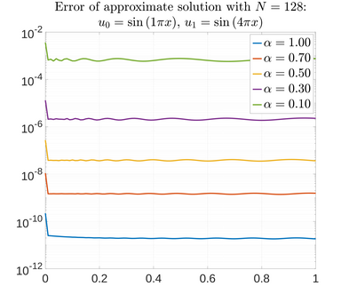
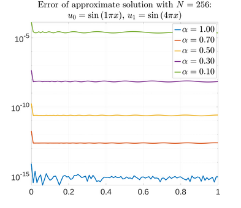

### Semi-discretized linear inhomogeneous problem with zero homogeneous part (Example 2)

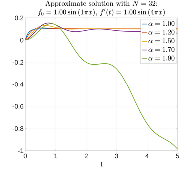

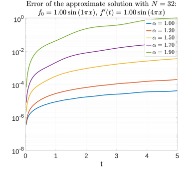
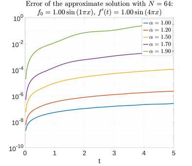
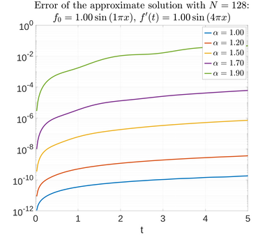

### Fully-discretized linear inhomogeneous problem with non-stationary right-hand side from Example 3

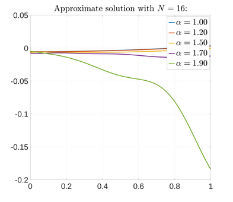

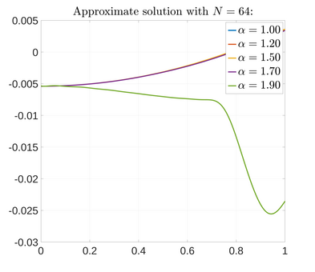
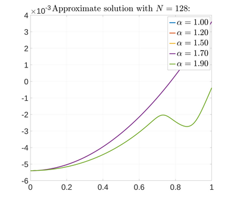

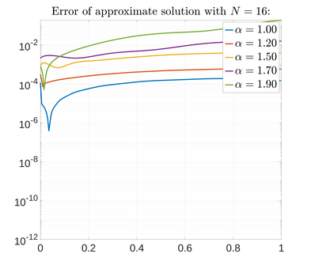
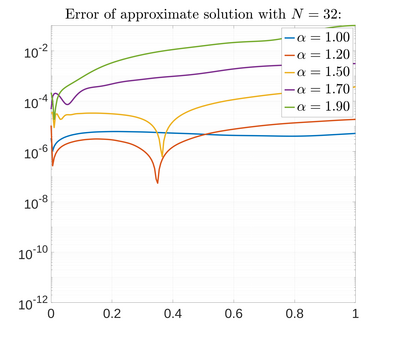
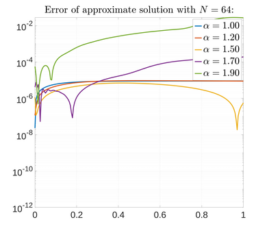

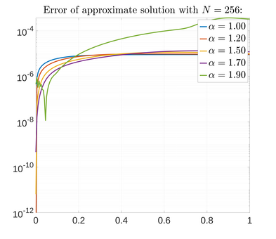

